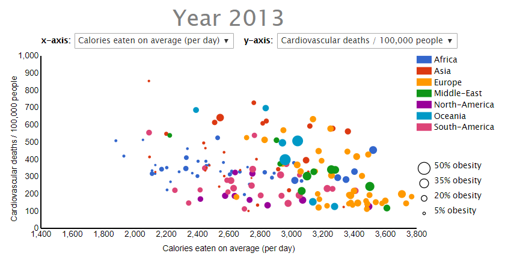

# Obesity around the world

## Link to website
https://tessaridderikhoff.github.io/Programmeerproject/

## Link to video
https://www.youtube.com/watch?v=k6pR4fj9WH8&feature=youtu.be

### Details
Tessa Ridderikhoff
Studentnumber: 10759697
28-6-2017

### Problem statement
A lot of people all over the world struggle with overweight and obesity, which leads to a lot of different theories about the causes and the impact. By comparing the different circumstances of countries with varying obesity prevelances, hopefully more clarity about healthy lifestyles can be given. Everyone who is interested in obesity or the impact of different lifestyles could benefit from this data visualisation.

### World map
First, we'll view a map of the world, in which the amount of obesity in each country is displayed. Lighter shades of red represent lower percentages of obesity in a country. This visualization helps users to get insight about the distrubution of obesity in the world, and decide which countries to view in the other visualisations.

To view the growth of obesity over the last 38 years, the slider can be used, which updates the world map. To only view either female or male data, the checkboxes can be checked and unchecked. The default is both checkboxes checked, which gives the average percentage of obesity for all adults in that country.

### Scatterplot
For additional information about the countries, we'll look at a scatterplot. For the x-axis, the user can choose various variables, all possible indicators for obesity. For the y-axis, the user can choose variables as well, all possible implications of obesity. The size of the dot represents the level of obesity in that country. The colour of the dot represents the continent that country is in.

The slider connected to the world map will update the scatterplot as well (if data is available). 

### Sankey diagram
When clicked on a country on the map or in the scatterplot, a Sankey diagram is created, providing information about the eating habits in a country (per day, on average). This way, the eating habits of different countries (and different years) can be viewed and compared.

When clicked on another country after that, a second Sankey diagram is created. This way, the user can easily compare two countries. The Sankey diagram is not automatically updated when the slider is used, but uses the year the country was representing in the world map or scatterplot when it was clicked. This way, the same country can also be compared over time. When clicked on a country for a third time (or fourth, or fifth..), the first Sankey diagram updates, and so forth.

### Libraries
- d3 library: https://d3js.org/
License: BSD 3-Clause "New" or "Revised" License (https://github.com/d3/d3/blob/master/LICENSE)
- jQUERY libary: https://jquery.com/
License: MIT license
- Bootstrap library: https://getbootstrap.com/
License: MIT license

### External functions
- Create slider: https://bl.ocks.org/Lulkafe/3832d628340038d9484fbd9edb705e01
- Lighten/darken colour: https://css-tricks.com/snippets/javascript/lighten-darken-color/
- moveToFront function: https://gist.github.com/johsh/9629458