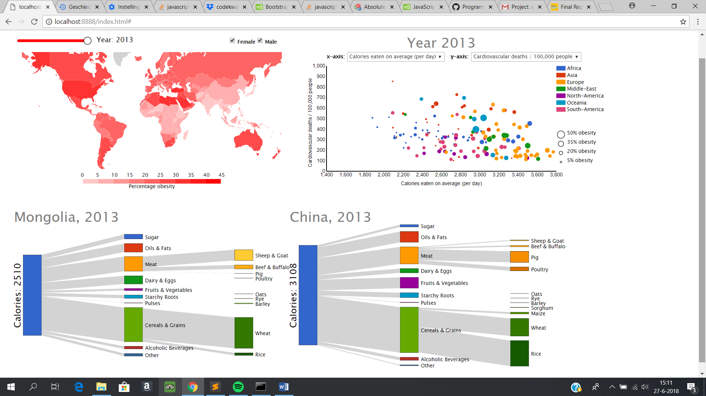

# Report Tessa Ridderikhoff

## Description product

To visualize obesity around the world, this product consists of 3 different types of graphs. The first one is a world map, displaying the percentage of obesity in each country with varying shades of red. Two checkboxes, female and male, and be checked or unchecked by the user, determining which data is displayed on the map. The second is a scatterplot, with adjustable variables for the x- and y-axis. The dots represent countries, the size of the dot represents the amount of obesity in that country. The slider in the top left corner can be used to adjust the years displayed in the world map and the scatterplot directly. When clicked on a country in the map or in the scatterplot, a Sankey diagram appears, displaying the amount of calories eaten on average a day by the population of that country, and which food groups those calories are eaten in. When clicked on another country, a second Sankey diagram appears, to allow the user to directly compare the eating habits of two countries. When the slider is set to a different year, the Sankey diagrams do not automatically update, but when pressed on a country again, the Sankey diagram will now show data for the newly selected year. 
Short version: To visualize obesity around the world, this product consists of 3 different types of graphs. The first is a world map, displaying the percentage of obesity in each country by colour. The second is a scatterplot, with adjustable variables for the x- and y-axis, all concerning either indicators of obesity (x-axis) or the implications (y-axis). The third is a Sankey diagram, displaying the eating habits of a country. 

## Technical design

**main.js**

When the window is loaded, the main function is called, which consists of the declaration of all datasets, and calls the functions to create the different graphs. A lot of datasets are loaded when the page is loaded:
-	The geoJSON of the world (world map)
-	AdultsObese (world map and scatterplot)
-	FemalesObese (world map)
-	MalesObese (world map)
-	Calories (scatterplot)
-	CardiovascularDeaths (scatterplot)
-	GDP (scatterplot)
-	InsuffientlyActive (scatterplot)
-	MeanYearsOfSchooling (scatterplot)
-	countryAbbreviations (Sankey diagram)
-	HighBloodPressure (scatterplot)
-	CancerPrevalence (scatterplot)
-	FoodgroupCalories (Sankey diagram)
-	CerealCalories (Sankey diagram)
-	meatPercentage (Sankey diagram)

When all datasets have been properly named, the main function first calls the createMap function, then the createSlider, the createScatter and finally the createSankey, which is called two times (for creating two separate diagrams). 

**createMap.js**

The first function in this script, the *createMap* function, is called by the main function and first creates a world map on the mapsvg. It then calls another function, *colourMap*, to colour each country according to their obesity percentage, in different shades of red. The createMap function then creates a tooltip and sets all instructions for when a country is hovered over (show tooltip, reduce opacity of other countries, colours own border black, select corresponding dot in scatterplot), or clicked on (create Sankey diagram). Furthermore, a legend for the world map is created, which is interactive when hovered over as well. 

Another function in this script is the *updateMap* function, which is called by the slider and changes the year of the data that is displayed in the world map. This is a very short function, which, after changing the year, calls the colourMap function again, to colour the world map again with this new data selection.

Next in the script is the *updateMapGender* function, which is called on change of the checkboxes (“female” and “male”). This function first checks which boxes are checked - either female, male, both or neither – and then selects the corresponding datasets. It then also calls the colourMap function, which changes the colours of the world map again, according to the newly selected dataset.

The *colourMap* function loops through the given dataset, colours each country according to this data, and updates the country’s class and obesity attribute (necessary for tooltip and legend interactivity).

**createSlider.js**

The main calls the function *createSlider*, which uses another function to create a slider, the *simpleSlider* function. The simpleSlider function creates a slider which the user can slide between 0 and 1. The createSlider function then translates this value between 0 and 1 to a year between 1975 and 2013. This way, the year that the user wants to select is determined. This year is given to the *updateYear* function, at the end of this script. This function calls the *updateMap* function, to update the year for the world map (this function has been discussed in the createMap.js section), and the *updateScatterYear* function, which updates the year of which data is displayed for the scatterplot. This function can be found in createScatter.js.

**createScatter.js**

The main function then calls the function *createScatter*, which creates a scatterplot in the scatter-svg. Each dot represents a country, the size of the dot is determined by the percentage obesity in that country that year, the colour of the country represents the continent the country is in. The x- and y-variables can be chosen by the user (default: x – Calories eaten on average a day, y – Cardiovascular deaths). The dropdown with which the user can chose these variables is created in this function, as well as the axes, the legends, the tooltip, the colour of the dot and the instructions for hovering over (show country on map, reduce opacity of other dots, show tooltip, draw crosshair) and clicking on dots (Sankey diagram of country). 
Two legends are created by this function, one for the colour of the dot (can be hovered over as well, this shows all dots in that category), and one for the size of the dot. The size of the dot is based on a continuous scale, so 4 points from that scale have been chosen as an example for the legend.

The createScatter function does not place the dots and determine their size itself, it calls the *updateVariableScatter* function. The updateVariableScatter function is also called when one of the dropdowns has been changed. This function checks which variables should be shown on the scatterplot, and prepares the datasets to show this data. It also updates the scales, the axes, the axis-titles and the title of the scatterplot (which displays the year of the data). Since not every year is available between 1975 and 2013 for every dataset, this function changes the year to a year that is available for the chosen dataset, if necessary. The axes change only between variables, not between year, to make it easier for the user to compare between years.

The updateVariableScatter function then calls the *updateScatter* function. This function uses the datasets for the x- and y-axes provided by the updateVariableScatter function and correctly places the dots in the scatterplot, with the size of the dot representing the level of obesity of that country. 

The *updateScatterYear* function is called when the user uses the slider to change the year. This function only updates the year and then calls the updateVariableScatter function to complete the update of the scatterplot.

The *c10* function is a colourfunction, used to determine the colour of the dots. It will also be used by the Sankey diagram. 

**createSankey.js**

The *createSankey* function is the first function in this script, and is called twice by the main function. The input argument of the function is the name of the svg the diagram needs to be drawn in, and since the user is able to create two Sankey diagrams, the function is called twice for two different svg’s. The Sankey diagram is only shown when the users has clicked on a country, so this createSankey function does not show any elements yet, but only initiates all elements. For example, all nodes of the diagram are created and given a class, colour, x-location, width, etc., but not a height and y-location. Therefore, the node is not yet drawn on the svg. It also creates the height-scale, the scale to determine the height of the nodes based on the amount of calories eaten in that category.

The *updateSankey* function is called when the user clicks on a country on the map or in the scatterplot. This function assigns a height and y-location for the first and all second nodes. It also sets the title for the diagram. When no data is found for the requested country and year, the function calls the *noDataMessage* function, to display a “no data available” message. If data has been found, the function calls the createThirdNodeSankey function twice, once for grain, and once for meat.

The *createThirdNodeSankey* function creates the third nodes, which provide extra information about either the types of grain eaten in a country or the types of meat. This is done similarly as the updateSankey function.

The *addSecondNodeLabels* function is called by the updateSankey function, and is created to add labels to the second nodes about the food groups the nodes represent. This is done at the end of the script to make sure the labels are in front of the links.

## Challenges & decisions
**HTML**
- The locations of all svg’s in my html page are fixed, to ensure they wouldn’t change their location when opened on a different computer, or when the console was opened. I also could have chosen to use the bootstrap grid-system, but for now this was the most efficient.

**Slider**
- It was harder than expected to create a slider to select the year to display. An update function for the world map to change years was quite quickly created, but the slider itself proved more of a challenge. In the end, I used a function from the internet, which created a slider with values between 0 and 1. I then translated the selected value to a year between 1975 and 2013. This is not an optimal solution and requires unnecessary extra code, but it does work. With more time available, I would improve this.

**Scatterplot**
- I had problems with creating the dropdown for the axes of the scatterplot, since the dropdowns wouldn’t load in the svg. In the end, I had to put them on top of the svg, with a fixed location.
- Not all years between 1975 and 2013 were available for every dataset that is used for the scatterplot. Since the slider updates both the world map and the scatterplot, I still wanted the user to be able to move the slider freely (and not stop the slider when years were not available for that dataset), so I chose to set the scatterplot-year to the nearest year available. This has the risk of being less clear for the user, since the scatterplot and the slider and world map now sometimes show data for different years. I tried to make this clear by putting the year that is displayed in the scatterplot prominently in the title of the scatterplot.

**Sankey diagram**
- In my original proposal, I wanted to create one Sankey diagram. However, after having done this, I decided it would be clearer if the user could compare two diagrams at the same time, by putting them beside each other. Since the Sankey diagram consists of a lot of elements, it would be hard for the user to remember each of those and compare the diagrams if they were not seen at the same time. The user can now also chose to click on the same country twice for different years, to compare the eating habits of a country over time. 

- I contemplated whether it would be best to update the Sankey diagram simultaneously with the world map and scatterplot, so directly when the slider was being moved. I chose to only update the Sankey diagram when clicked on a country, so the user has the option to compare two different years. I also think it may be too chaotic if the Sankey diagram would change constantly, and the site might be more prone to errors.

- It was hard to create two diagrams for comparison, since all elements would only be created once. I fixed this by giving the svg-name as input argument for all Sankey functions, and then use this to select the right svg. This worked, and two diagrams could be created for different countries and years. However, when the user would switch between the two diagrams, for example by clicking on the grain-foodgroup for additional information, the information of the last-created diagram would be shown, since this svg was selected last, even if the user clicked on the other diagram. I therefore chose to make the Sankey diagrams less interactive, all information is now shown directly when clicked on a country. The same problem presented itself with the tooltips, so I created two different tooltips for the different svg’s. These solutions are not optimal, but was the most practical at the moment.

- Creating the Sankey diagram requires a lot of elements, and a lot of saving of variables, since all elements have to be placed at the correct location with the correct height. Especially since two diagrams are created, and the user has to be able to switch between these diagrams. The third nodes of the diagram are created with a function that is similar to the creation of the second nodes, which is not very efficient. However, with the time available, I haven’t had the chance to improve the efficiency of this script as much as I would like to.

- The Sankey diagram is higher when more calories are consumed on average in a country, which can sometimes lead to the title of the diagram not being entirely visible, especially when a country has a long name. I therefore chose to use the abbreviation of a country’s name when the name of a country exceeded more than 12 letters. I could also have chosen to use another location for the title in that case, or a smaller font, but I thought this was best for the design of the diagram.
